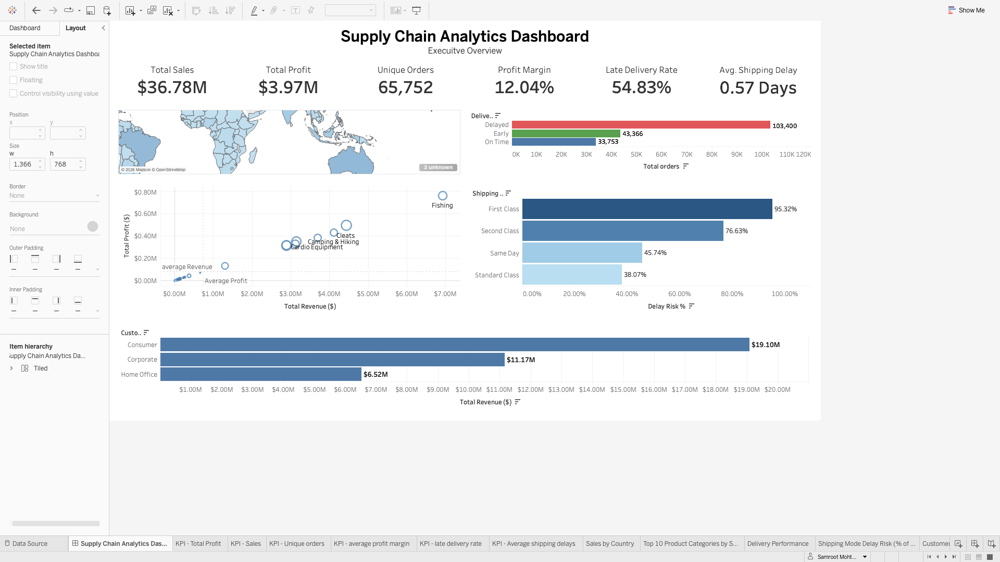

# Supply Chain Analytics Dashboard | Executive Overview

## Project Overview

This project presents an end-to-end supply chain analytics solution built using Python, Pandas, Tableau, and PostgreSQL. The objective is to analyze global supply chain operations, identify business trends, evaluate delivery performance, and provide actionable insights through an interactive executive dashboard.

The project demonstrates the complete analytics workflow, including data exploration, cleaning, feature engineering, exploratory data analysis (EDA), KPI development, and dashboard design.

---

## Dashboard Preview



---

## Live Dashboard

[View the interactive Supply Chain Analytics Dashboard on Tableau Public🔗]: https://public.tableau.com/app/profile/samroot.mohtesham/viz/SupplyChainAnalyticsDashboardExecutiveOverview/SupplyChainAnalyticsDashboard

---

## Business Problem

Supply chain managers often struggle to answer key business questions such as:

- Which markets generate the highest revenue?
- Which product categories are the most profitable?
- Which shipping methods experience the highest delivery delays?
- How do different customer segments contribute to revenue?
- Which operational areas require immediate attention?

This project transforms raw operational data into meaningful business insights to support data-driven decision making.

---

## Tools & Technologies

- Python (Pandas)
- SQL
- PostgreSQL
- Tableau Public
- Git
- GitHub

---

## Dataset

The project uses the **DataCo Supply Chain Dataset**, containing **180,519 records and 53 columns** across orders, customers, products, sales, shipping, and delivery operations.

During data discovery, missing values were identified in customer-related fields, including `Customer Lname` and `Customer Zipcode`. Personal customer information was excluded from the analysis to follow GDPR-conscious data handling principles.

---

## Project Workflow

1. Imported and explored the raw CSV dataset using Python and Pandas.
2. Reviewed data types, missing values, duplicates, and overall data quality.
3. Standardized column names for easier analysis.
4. Created analytical features for shipping delays, delivery performance, and profit margins.
5. Investigated sales, profitability, products, customers, and shipping performance.
6. Developed business KPIs and an interactive executive dashboard in Tableau to support operational decision-making.
7. Published the final dashboard on Tableau Public.

---

## SQL Analysis

PostgreSQL was used to validate the processed dataset and answer business questions related to:

- Executive KPIs
- Delivery performance
- Shipping-mode risk
- Country and market performance
- Product-category profitability
- Customer-segment performance
- Delayed sales and profit exposure

The SQL scripts are organized in execution order:

1. `01_create_table.sql` — creates the PostgreSQL table.
2. `02_data_quality_checks.sql` — validates completeness, duplicates, engineered fields, and numerical values.
3. `03_business_analysis.sql` — calculates KPIs and performs operational and profitability analysis.

---

## Executive Dashboard Features

The interactive Tableau dashboard provides an executive-level overview of global supply chain performance through the following components:

- Executive KPI cards
  - Total Sales
  - Total Profit
  - Unique Orders
  - Average Profit Margin
  - Late Delivery Rate
  - Average Shipping Delay

- Sales by Country
- Delivery Performance Analysis
- Product Category Performance
- Shipping Mode Delay Risk
- Customer Segment Performance

### Dashboard Interaction

Users can click on any country in the map to dynamically filter the remaining visualizations, enabling detailed country-level performance analysis.

---

## Key Business Insights

- 57.28% of orders experienced delivery delays, indicating opportunities to improve logistics performance.
- First Class shipping recorded the highest delay risk (95.32%), suggesting premium shipping does not always translate to better operational performance.
- Standard Class achieved the lowest delay risk (38.07%), indicating a more stable fulfillment process.
- Product profitability varied significantly across categories, highlighting opportunities to optimize the product portfolio.

---

## Repository Structure

```text
supply-chain-analytics/
│
├── data/
│   ├── raw/
│   └── processed/
├── docs/
├── images/
├── notebooks/
├── tableau/
└── README.md
```

---

## Skills Demonstrated

This project demonstrates practical experience in:

- Python (Pandas)
- SQL
- PostgreSQL
- Data Cleaning
- Exploratory Data Analysis
- Feature Engineering
- Data Visualization
- Tableau Dashboard Development
- Business Intelligence
- Business Storytelling

---

## Business Impact

This dashboard transforms operational supply chain data into actionable insights that support faster, evidence-based decision-making. It enables supply chain managers to:

- Monitor operational KPIs from a single executive view.
- Identify high-risk shipping methods.
- Compare profitability across product categories.
- Evaluate customer segment performance.
- Explore country-level performance using interactive filtering.

---

## Future Improvements

Potential enhancements include:

- Predictive demand forecasting using machine learning.
- Customer segmentation using clustering techniques.
- Inventory optimization analysis.
- Interactive date and product filters.
- Automated ETL pipeline for dashboard refreshes.
- Deploy dashboards using Tableau Server / Tableau Cloud.

---

## About the Author

**Samroot Mohtesham**

- GitHub: https://github.com/Samroot-Mohtesham
- Tableau Public: https://public.tableau.com/app/profile/samroot.mohtesham
- LinkedIn: https://www.linkedin.com/in/samroot-m/


---

⭐ If you found this project interesting, feel free to explore the interactive dashboard and repository.